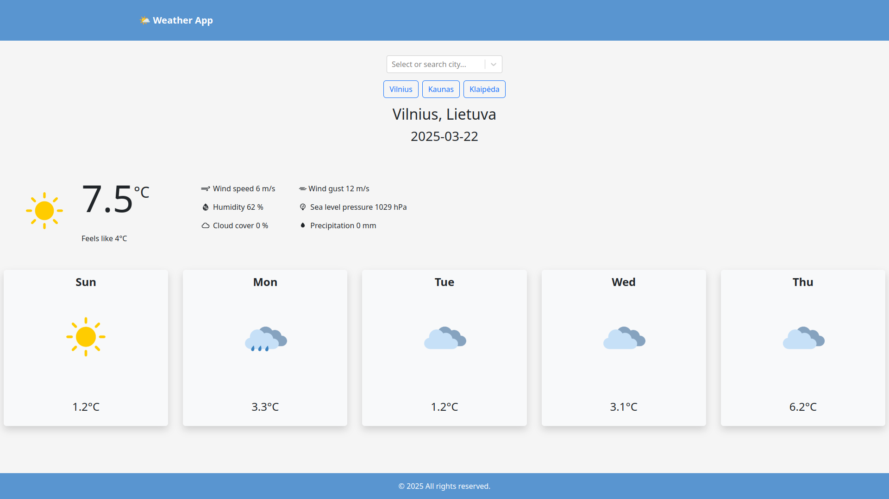
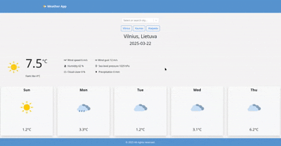
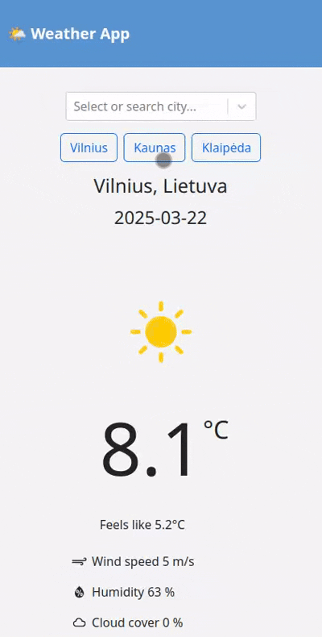

# 🌦️ Weather App

A modern and responsive weather forecast web application built with React, displaying real-time weather information with a sleek UI, dynamic icons, and support for location-based search. Users can quickly check the weather in popular cities and see a 5-day forecast.

## 🚀 Features

- 🔍 **Searchable Dropdown**: Easily find a city using a searchable dropdown powered by `react-select`.
- 📊 **Current Weather Display**: Temperature, feels-like, wind speed, humidity, cloud cover, precipitation and more.
- 🗓️ **5-Day Forecast**: Minimal, responsive cards with daily temperature and condition icons.
- 💾 **Most Viewed Cities**: Browser remembers the 3 most viewed cities and displays quick-access buttons.
- 🎨 **Custom Weather Icons**: Custom-designed icons for conditions like rain, thunder, sleet, snow, and clear skies.
- 📦 **Persistent Storage**: Uses `localStorage` to remember the last selected city and recently viewed cities.
- 📱 **Responsive Design**: Fully responsive and mobile-friendly using Bootstrap.
- ☁️ **Error Handling**: Toast notifications for missing cities, failed API calls, and invalid inputs.
- 📝 **User Action Logging**: Backend logs every selected city along with the timestamp to the server console.

## 🛠️ Technologies Used

- **React**
- **React Context API**-
- **Bootstrap 5**
- **SCSS**
- **Node.js**

## 🖼️ UI Preview

  
  
  

## 🧪 Getting Started

1.  Clone the repository
2.  Setup backend

```bash
cd backend
npm i
```

- Create .env file in root directory use .env example as a reference.
- Enter server port. I was using 3000.
- Database is currently not in use.

```bash
DB_HOST=your data
DB_USER=your data
DB_PASSWORD=your data
DB_PORT=your data
DB_DB=your data

SERVER_PORT=3000
```

Start the server

```bash
npm start
```

3. Setup frontend

```bash
cd frontend
npm i
```

- Create a .env file in the root of the frontend directory and add your backend URL:

<em>VITE_BACKEND_URL=http://localhost:3000</em>

Start the frontend

```bash
npm run dev
```

## Author

Ovidijus Eitminavčius
